## 简介

安卓课程作业，做了一个rss阅读器，添加feed源后可以订阅相关rss。

整体组件、逻辑参考了《第一行安卓代码》，各组件了google material组件。

## 运行截图

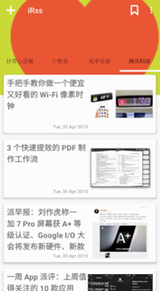

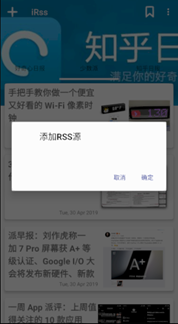

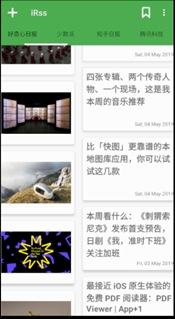

## MVC

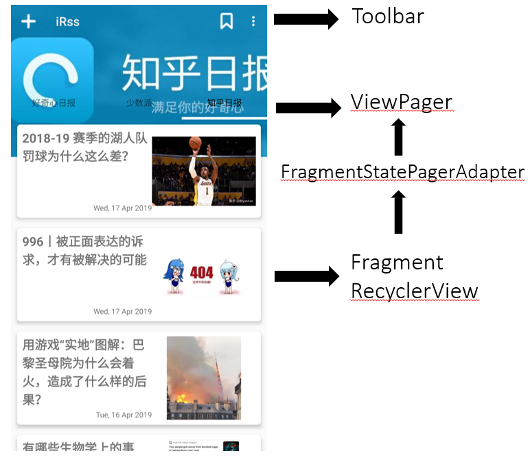

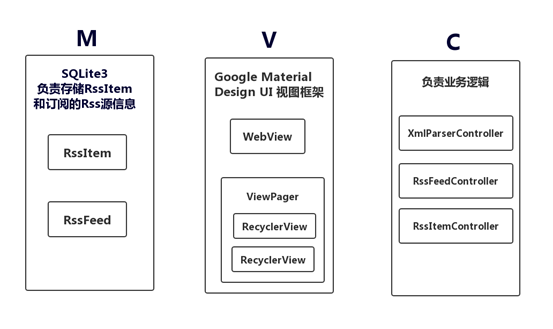

### 模型层负责存储数据

l Rssitem 一条新闻所包含的rss信息

l RssFeed 从xml中解析出的信息对象

### 视图层负责渲染Rssitem

l 由Viewpage负责切换RssFeed列表

l WebView负责渲染Rssitem的内容

l RecycleView和适配器负责将Rssitem渲染成列表

### 控制器负责业务代码的抽离

l 对模型的增删改查

l 视图的切换逻辑

## 数据库部分

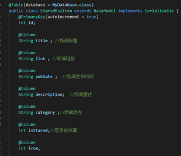

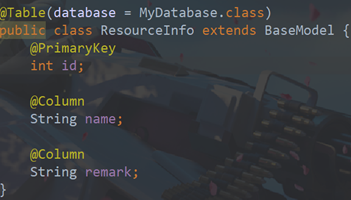

使用DBflow对数据库进行操作,以上分别为rssitem表和rss源记录表,记录了每个rssitem的信息和他们所属源的信息.

用户在webview中浏览新闻详细信息时,可以如上面截图中展示那样选择收藏,则会更新数据库中的isStared字段.

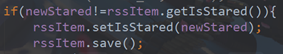

将联网获得的所有rssitem存入

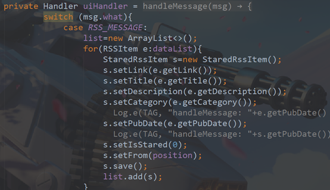

## 相关事件处理以及UI装载

1用户点击一条新闻后,将此新闻信息传入intent中交给webview打开

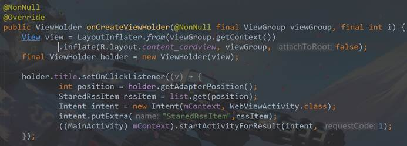

2 判定当前页面所属rss源,生成新的instance去获得信息列表装载后返回给viewPager

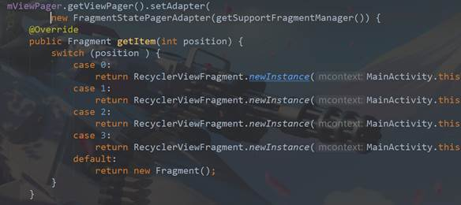

3 相关Cardview Toolbar

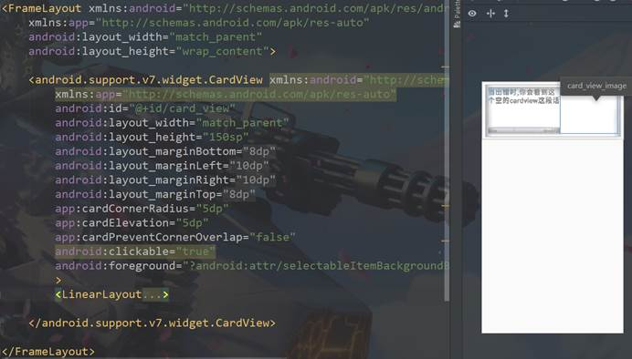

上为rssitem瀑布流的单个item装载布局

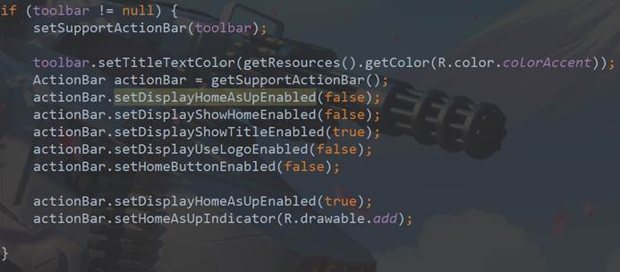

上为toolbar相关设置

 